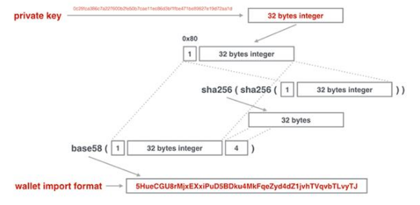

# blockchain

## bitcoin

- 创建了无需信任中心的货币发行机制；
- 发行数量由程序决定，无法随意修改；
- 交易账本完全公开可追溯，不可篡改；
- 密码学理论保证货币防伪造，防双花；
- 数字签名机制保证交易完整可信，不可抵赖和撤销。

### hash算法

+ hash256/dhash: SHA-256+SHA-256
+ hash160: SHA-256+RipeMD160

### 区块链不可篡改特性

#### merkle hash

merkle hash记录了本区块所有的merkle hash


计算方式: 两个计算hash之后相加


#### block hash

区块头部的prev hash记录了上一个区块的block hash


### 数字签名

发送方：signature=sign(message,SK)

接收方：verify(message,signature,PK)

比特币数字签名算法：ECDSA

y^2=x^3+7

私钥是256位整数，公钥是2个256位整数

### packet

钱包软件是用来帮组用户管理私钥的

### public key and private key


#### private key（secrete key SK）

对私钥进行编码   256位整数->字符串

非压缩格式的私钥编码(几乎不用)

5开头



压缩格式的私钥编码

K或L开头


#### public key

由于ECC曲线的特点，根据非压缩格式的公钥`(x, y)`的`x`实际上也可推算出`y`，但需要知道`y`的奇偶性，因此，可以根据`(x, y)`推算出`x'`，作为压缩格式的公钥。

压缩格式的公钥实际上只保存`x`这一个256位整数，但需要根据`y`的奇偶性在`x`前面添加`02`或`03`前缀，`y`为偶数时添加`02`，否则添加`03`，这样，得到一个1+32=33字节的压缩格式的公钥数据，记作`x'`。

压缩格式的公钥和非压缩格式的公钥是可以互相转换的，但均不可反向推导出私钥。


地址以1开头

## ethereum

### data structure

+ RLP
+ MPT Merkle Patricia Tree


### transaction structure


### transaction process


### ethereum block


### address


Instead of UTXO model in bitcoin, ethereum uses one account one balance model. It contains accounts as follows:

+ EOA 
+ COA
+ 0x0
+ 0xdead

### state of ethereum


### Mining


分叉问题：最大难度原则

### EVM

+ 基于栈的虚拟机，一次调用产生一个实例
+ 每一个栈的元素大小是32字节
+ 大小无限制，调用深度上限1024
+ 临时/永久存储区别


### Deploy

compile in windows
```go
go get github.com/ethereum/go-ethereum
cd %GOPATH%\src\github.com\ethereum\go-ethereum
go install -v ./...
```
edit the genesis.json
```json
{
    "nonce": "0x0000000000000042",
    "difficulty": "0x400",
    "mixhash": "0x0000000000000000000000000000000000000000000000000000000000000000",
    "coinbase": "0x0000000000000000000000000000000000000000",
    "timestamp": "0x00",
    "parentHash": "0x0000000000000000000000000000000000000000000000000000000000000000",
    "extraData": "0x11bbe8db4e347b4e8c937c1c8370e4b5ed33adb3db69cbdb7a38e1e50b1b82fa",
    "gasLimit": "0x4c4b4000000",
    "config": {
        "chainId": 1534,
        "homesteadBlock": 0,
        "eip150Block": 0,
        "eip155Block": 0,
        "eip158Block": 0,
        "byzantiumBlock": 0,
        "constantinopleBlock": 0,
        "petersburgBlock": 0
    },
    "alloc": {
		"address": {
            "balance":"0x800000000000000000000"
        }
	}
}
```
address is created by the next step

deploy a test node
```shell
cd %GOPATH%\bin
geth account new --datadir testnet\chaindata   //modify the genesis file accourding to the address
geth removedb --datadir testnet\chaindata\
geth --identity "BlockGeekTestNode" --datadir testnet\chaindata init testnet\genesis.json
geth --http --http.addr 0.0.0.0 --http.corsdomain "*" --ws --ws.addr 0.0.0.0 --ws.origins "*" --datadir testnet\chaindata --networkid 1534 --nodiscover --allow-insecure-unlock
```

test
```javascript
geth attach \\.\pipe\geth.ipc
personal.newAccount("test1") //create new account
eth.accounts                  // all accounts
web3.fromWei(eth.getBalance(addr),"ether")  //get the ether
miner.setEtherbase(addr3)                   //set the behalf of miner
eth.coinbase                               //the behalf of miner
eth.blockNumber                            // block number
personal.unlockAccount(addr1,"password")        //unlock the account 
eth.sendTransaction({from:addr1,to:addr2,value:web3.toWei(10.0,'ether')})   //tx

txpool.status                                   //transaction status
miner.start()
miner.stop() 

eth.getBlock(1)
eth.getTransaction("hash")
```

## Filecoin

### Deploy

It can only be deployed on linux or macos. Take centos for example

```shell
# Pre Requirement
sudo yum install -y https://dl.fedoraproject.org/pub/epel/epel-release-latest-7.noarch.rpm; sudo yum install -y git gcc bzr jq pkgconfig clang llvm mesa-libGL-devel opencl-headers ocl-icd ocl-icd-devel hwloc-devel
# Rustup
curl --proto '=https' --tlsv1.2 -sSf https://sh.rustup.rs | sh
# Go
wget -c https://golang.org/dl/go1.15.5.linux-amd64.tar.gz -O - | sudo tar -xz -C /usr/local
# lotus
git clone https://github.com/filecoin-project/lotus.git
cd lotus/
# choose a network
git checkout master # mainnet
git checkout ntwk-calibration # calibration-net
git checkout ntwk-nerpa # nerpa-net
# install lotus
make clean all
sudo make install
# start For mainnet only:
lotus daemon --import-snapshot https://fil-chain-snapshots-fallback.s3.amazonaws.com/mainnet/minimal_finality_stateroots_latest.car
```

By default, the API listens on the local "loopback" interface (`127.0.0.1`). This is [configured](https://docs.filecoin.io/get-started/lotus/configuration-and-advanced-usage.html) in the `config.toml` file:

```shell
[API]
  ListenAddress = "/ip4/<EXTERNAL_INTERFACE_IP>/tcp/3453/http" # port is an example
  # Only relevant for lotus-miner
  RemoteListenAddress = "<EXTERNAL_IP_AS_SEEN_BY_OTHERS<EXTERNAL_PORT_AS_SEEN_BY_OTHERS>"
```

