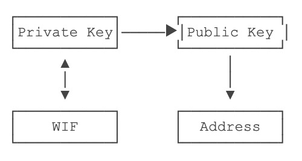

# blockchain

## bitcoin

- 创建了无需信任中心的货币发行机制；
- 发行数量由程序决定，无法随意修改；
- 交易账本完全公开可追溯，不可篡改；
- 密码学理论保证货币防伪造，防双花；
- 数字签名机制保证交易完整可信，不可抵赖和撤销。

## hash算法

+ hash256/dhash: SHA-256+SHA-256
+ hash160: SHA-256+RipeMD160

## 区块链不可篡改特性

### merkle hash

merkle hash记录了本区块所有的merkle hash

计算方式: 两个计算hash之后相加

### block hash

区块头部的prev hash记录了上一个区块的block hash

## 数字签名

发送方：signature=sign(message,SK)

接收方：verify(message,signature,PK)

比特币数字签名算法：ECDSA

y^2=x^3+7

私钥是256位整数，公钥是2个256位整数

## packet

钱包软件是用来帮组用户管理私钥的

## public key and private key

### private key（secrete key SK）

对私钥进行编码   256位整数->字符串

非压缩格式的私钥编码(几乎不用)

5开头

压缩格式的私钥编码

K或L开头

### public key

由于ECC曲线的特点，根据非压缩格式的公钥`(x, y)`的`x`实际上也可推算出`y`，但需要知道`y`的奇偶性，因此，可以根据`(x, y)`推算出`x'`，作为压缩格式的公钥。

压缩格式的公钥实际上只保存`x`这一个256位整数，但需要根据`y`的奇偶性在`x`前面添加`02`或`03`前缀，`y`为偶数时添加`02`，否则添加`03`，这样，得到一个1+32=33字节的压缩格式的公钥数据，记作`x'`。

压缩格式的公钥和非压缩格式的公钥是可以互相转换的，但均不可反向推导出私钥。

地址以1开头

## ethereum

### data structure

+ RLP
+ MPT Merkle Patricia Tree

